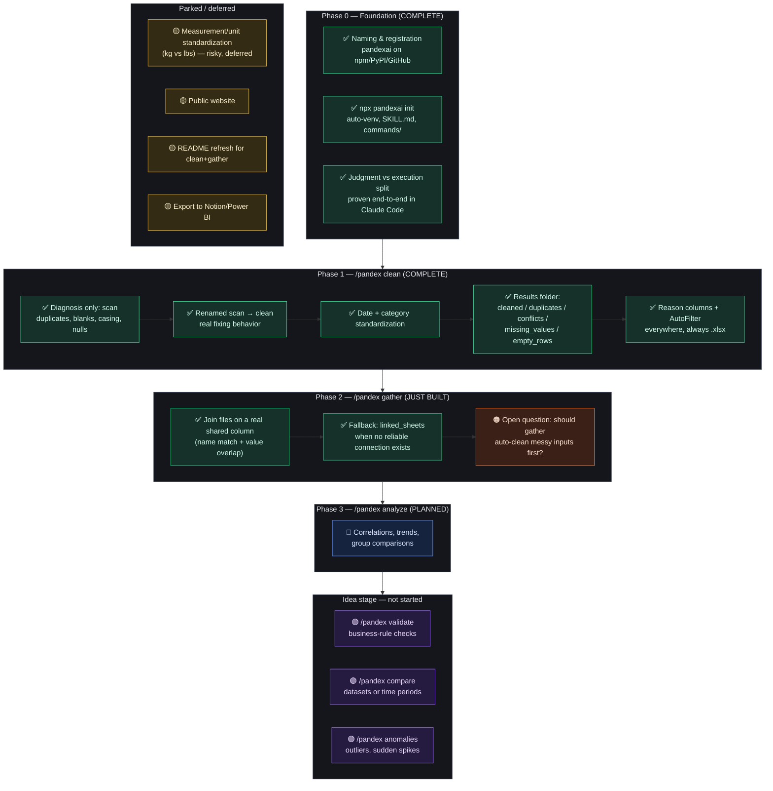

# PandexAI — Visual Roadmap

A single-glance view of the whole project. See `03-Roadmap.md` for the detailed narrative history behind each item.

## Legend
- ✅ **Done and published**
- 🔵 **Planned, not started**
- 🟣 **Idea stage, no design yet**
- 🟡 **Deliberately deferred**
- 🟠 **Open question, needs a decision**

## Current state (as of 2026-09-03)
- **`/pandex clean`** — feature-complete for this round. Results folder, reason columns, conflict detection, AutoFilter everywhere.
- **`/pandex gather`** — just built and published. Joins on a genuinely shared column (name + value overlap, not just name), or falls back to keeping files as separate sheets. Open question pending: should it auto-clean messy input files before joining, or require the user to run `clean` first?
- **`/pandex analyze`** — not started. Next natural candidate after `gather` settles.
