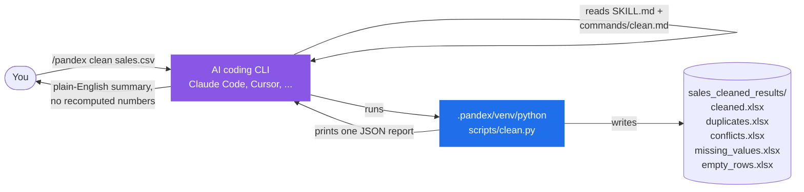
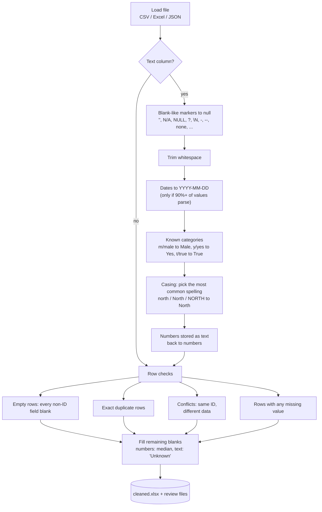
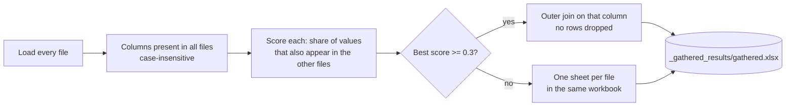

# PandexAI

[](https://github.com/jahirulanik/pandexai/actions/workflows/ci.yml)
[](https://www.npmjs.com/package/pandexai)
[](LICENSE)

**Clean, combine, and analyze data files from inside your AI coding CLI, with numbers you can trust.**

PandexAI runs inside Claude Code, Cursor and similar tools. You type a command like
`/pandex clean sales.csv`; a real pandas script does the work, deterministically, and
prints one JSON report. The AI never recomputes or estimates a number — it only reads
the report and explains it to you in plain English.

```
/pandex clean sales.csv                    # fix it: duplicates, missing values, formatting
/pandex gather orders.csv customers.csv    # combine files into one workbook
/pandex profile sales.csv                  # per-column stats and data-quality signals
/pandex analyze orders.csv                 # correlations, trends, group comparisons, outliers
```

- **Input:** any `.csv`, `.xlsx`, `.xls` or `.json` file. Originals are never modified.
- **`clean`/`gather`** write their results to a new folder next to the input file.
  **`profile`/`analyze`** are read-only — nothing is written to disk.
- **No filename?** `clean` and `analyze` automatically pick up whatever `gather` last
  produced in the project, so a `gather` → `clean` → `analyze` chain needs a filename
  only once.
- **Tested on real data:** UCI Adult, UCI Automobile, Titanic, OpenFlights and
  Northwind are in the repository and checked on every commit. See the results below.

## How it works



Every command follows the same shape, written into `SKILL.md` so the AI reads it first:

| | Who | Where |
|---|---|---|
| **Execution**: anything that computes a number (counts, medians, correlations, joins) | Python / pandas, deterministically | `scripts/` |
| **Judgment**: interpreting the report, deciding what matters, explaining it | The AI | `SKILL.md`, `commands/*.md` |

Every script prints a single JSON object and exits 0 on success, or exits 1 with
`{"error": "plain English reason"}`. The markdown files tell the AI which fields to
read and forbid it from estimating anything a script could compute.

## Install

Inside the project where your data lives:

```bash
npx pandexai init
```

This creates an isolated Python environment at `.pandex/venv`, installs pandas and
openpyxl into it, and copies `SKILL.md`, `commands/`, `scripts/` and `.claude/` into
your project so the AI can find them. Requirements: Python 3.10+ and Node 18+.

## `clean <file>`

Runs every column through the rules below, in order, then looks at the rows.



The results folder contains:

| File | Created when | Contents |
|---|---|---|
| `cleaned.xlsx` | always | Final data. AutoFilter on every column, auto-sized widths |
| `duplicates.xlsx` | exact duplicates found | Every copy, with a `reason` column |
| `conflicts.xlsx` | rows share an ID but differ elsewhere | The rows, with a `reason` listing the differing fields |
| `missing_values.xlsx` | some rows had blanks | The original rows before filling, with a `reason` listing the blank fields |
| `empty_rows.xlsx` | rows were blank apart from the ID | The removed rows |

Rules are deliberately conservative. A column is only treated as dates if at least
90% of its values parse; categories are only mapped when every value in the column
belongs to one known group; numbers with leading zeros (postal codes) stay text.
When the tool is unsure, it leaves the data alone and lets the AI flag it.

## `gather <file1> <file2> [...]`

Combines files into one workbook. A column is used as the join key only if its
**values** overlap across every file, not just its name. Two files that both have a
`notes` column will not be joined on it. Run with no filenames and it auto-discovers
every CSV/Excel/JSON file in the project folder instead.



## `profile <file>`

A quick, read-only look at one file before deciding what to do with it. Reports, per
column: null percentage, unique-value count, mean/median/min/max for numeric columns,
top values for categorical ones, blank-like value counts, inconsistent casing, and
duplicate values. Nothing is written to disk.

## `analyze [file]`

Everything `profile` reports, plus the next questions a data analyst would ask:

| Analysis | What it does |
|---|---|
| **Correlations** | Pearson correlation between every pair of numeric columns (ID-like columns excluded), strongest pairs first |
| **Trends over time** | If a date column is found, buckets rows into an auto-picked period (day/week/month/year, based on how much time the data spans) and reports the first-vs-last period change, direction, and percent change |
| **Group comparisons** | For every categorical-shaped column, compares each numeric column's average across groups (e.g. "average order value by region"), highlighting the highest- and lowest-scoring group |
| **Outliers** | Classic IQR fences (1.5x interquartile range beyond Q1/Q3) per numeric column, with counts, percentages, and example values |

Falls back to the last file `gather` produced when run with no filename, same as
`clean`. Entirely read-only.

## Results on real data

These datasets live in [`real_data/`](real_data/README.md) unmodified, and
[`tests/test_real_data.py`](tests/test_real_data.py) checks every number below on each
commit, recomputing the expected values from the raw files with plain pandas.

| Dataset | What is wrong with it | What `clean` did | Verified |
|---|---|---|---|
| **Titanic** (891 rows) | 177 missing ages, 687 missing cabins, lowercase sexes | Ages filled with the median (28), cabins with "Unknown", `male`/`female` mapped to `Male`/`Female`, PassengerId confirmed unique | no nulls left, numeric columns byte-identical to the input |
| **UCI Adult** (1500 rows) | every text cell has a leading space, `?` marks 244 missing cells, one exact duplicate row | 13,000+ cells trimmed, all 244 `?` cells found and filled, 1 duplicate removed and written to `duplicates.xlsx` | counts match an independent pandas scan of the raw file |
| **UCI Automobile** (205 rows) | `?` in price, horsepower and four other numeric columns, which makes pandas read them as text | `?` removed, columns converted back to numbers, gaps filled with each column's median (price: 10,295) | every affected column is numeric in `cleaned.xlsx`; no `?` remains |
| **OpenFlights airlines** (1500 rows) | MySQL `\N` for null in 1496 alias cells, `Y`/`N` flags | `\N` recognised as missing, flags mapped to `Yes`/`No` | no `\N` in the output, IDs unchanged |
| **Northwind customers + orders** | 24 of 91 customer lines and 176 of 830 order lines have an unquoted comma inside a company name, so pandas refuses the files | Malformed lines skipped and their line numbers reported; `gather` then joined the two files on `customerID` with a 1.0 overlap score | 654 orders, one row each, every order matched to its customer |

Two bugs in the tool were found this way and are fixed and covered by tests: any
column whose name merely *contained* "id" (like `width`) was treated as an ID column,
producing 190 false conflicts on the Automobile data; and `?` / `\N` / `NULL` were not
recognised as missing values at all.

## Project status

**Works today**

- `clean`, `gather`, `profile` and `analyze`, as described above, on CSV, Excel and JSON.
- Non-UTF-8 files fall back to latin-1 and say so in the report.
- Malformed CSV lines are skipped and reported by line number instead of failing the file.
- Every JSON field the AI is told to present is covered by a test.

**Known limitations**

- `gather` needs the join column to have the *same name* in every file. `customer_id`
  in one file and `customerID` in another will match; `cust_id` will not.
- `gather`'s join-column picker doesn't yet guard against picking a low-cardinality
  column (a status/category code) purely because its values overlap well - can produce
  an unexpectedly huge joined result. Prefer files that share a real, high-cardinality
  key (an order ID, a customer ID) until this is fixed.
- Filling text blanks with "Unknown" and numbers with the median is a fixed policy.
  There is no per-column choice yet.
- Malformed CSV lines are dropped, not repaired. The line numbers are in the report so
  you can fix them by hand.
- `analyze`'s trend/group/outlier analysis runs on the raw file - it doesn't know a
  column like a shipping-method code is categorical rather than a real quantity, so a
  correlation or trend involving it should be read with judgment, not taken at face value.

**Roadmap**: `validate` (business-rule / data-quality checks), `compare` (diff two
files or periods), `anomalies` (broken relationships between gathered files),
configurable fill strategies, fuzzy join-column matching for `gather`.

## Contributing

Read [CONTRIBUTING.md](CONTRIBUTING.md). It covers the layout, how to run the tests,
what CI checks, how to add a cleaning rule or a dataset, and how releases work. The
short version:

```bash
git clone https://github.com/jahirulanik/pandexai && cd pandexai
python3 -m venv .venv && source .venv/bin/activate
pip install -r requirements-dev.txt
pytest            # 76 tests, well under a minute
ruff check scripts tests
```

Good first contributions: a public dataset that breaks a rule (add it to `real_data/`
with a failing test), a new blank-like marker you have met in the wild, or a category
group beyond gender / yes-no / true-false.

## License

MIT
